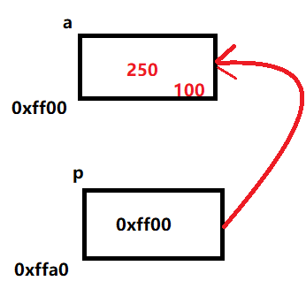
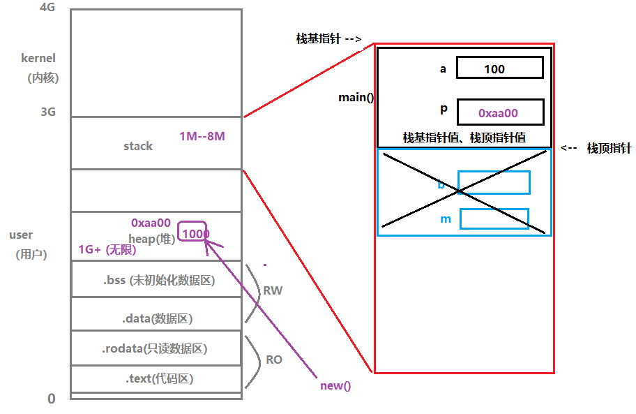

# Go语言加强

## 指针

### 概念

先来看一段代码

```go
func main() {
	var a int = 10
	var p *int = &a
	a = 100
	fmt.Println("a = ", a)
	*p = 250	//借助a变量的地址，操作a对应空间
	fmt.Println("a = ", a)
	fmt.Println("*p = ", *p)
    a = 1000
	fmt.Println("*p = ", *p)
}
```

输出结果如下：

```cmd
a =  100
a =  250
*p =  250
*p =  1000
```

指针就是地址。指针变量就是存储地址的变量。

*p: 解引用、间接引用

图解：



### 栈帧

用来给函数运行提供内存空间。 取内存于 stack 上。

当函数调用时，产生栈帧。函数调用结束时，释放栈帧。

栈帧存储：1.局部变量	2.形参（形参与局部变量存储地位等同）	3.内存字段描述值

为了方便描述，我们在上面的代码基础上做一些修改

```go
func test(m int) {
	var b int = 100
	b += m
	fmt.Println(b)
}

func main() {
	var a int = 10
	var p *int = &a
	a = 100
	fmt.Println("a = ", a)
	test(10)
	*p = 250
	fmt.Println("a = ", a)
	fmt.Println("*p = ", *p)
	a = 1000
	fmt.Println("*p = ", *p)
}
```

下面是整个程序的运行图：



在运行main函数时，会开辟一个空间供main函数存储局部变量，并且栈顶指针向下移动。在代码运行到`test(10)`之后，会开辟一个空间供test函数存储局部变量和形参，然后依旧向下移动指针。当test函数运行完毕后，删除这个栈帧，然后将栈顶指针向上移动，移动回main函数。

### 指针使用注意

空指针：违背初始化的指针。例如`var p *int`，此时`*p --> err`

野指针：被一片无效的地址空间初始化

野指针例子如下：

```go
func main() {
	var p *int = 0
	fmt.Println(*p)
}
```

此时运行会报出如下异常：

```cmd
# command-line-arguments
.\01-指针的应用.go:25:15: cannot use 0 (untyped int constant) as *int value in variable declaration
```

此时p指向的是一个无效的地址空间，编译时一定会报错

但是现在我们并不想通过定义一个变量然后再用指针指向它，而是想定义一个指针，然后让指针指向这个新开辟的内存空间。这个时候我们可以使用`new`关键字

示例如下：

```go
func main() {
	/*	var a int = 10
		fmt.Println("&a", &a)*/
	var p *int

	//在heap上申请一片内存地址空间
	p = new(int) //默认类型的默认值
	fmt.Println(*p)
}
```

这个时候指针就不是空指针和野指针了，也可以用语法来修改这个变量。

### 指针的函数传参

1. 传地址（引用）：将形参的地址值作为函数参数传递
2. 传值（数据）：将实参的值拷贝一份给形参
3. 传引用：在A栈帧内部，修改B栈帧中的变量值

这个在基础语法部分就有讲过（当然其他语言也具有这个特性）

举一个例子来说明：

```go
func swap(a int, b int) {
	a, b = b, a
	fmt.Println(a, b)	//20，10
}

func main() {
	a, b := 10, 20
	swap(a, b)
	fmt.Println(a, b)	//10，20
}
```

上述是典型的值传递，所以打印结果也显而易见。

但是如果我们使用地址传递，则可以彻底交换两个值。

```go
func swap(a *int, b *int) {
	*a, *b = *b, *a
	fmt.Println(*a, *b)
}

func main() {
	a, b := 10, 20
	swap(&a, &b)
	fmt.Println(a, b)
}
```

上述就是地址传递，两个参数传递的都是地址。

## 切片

